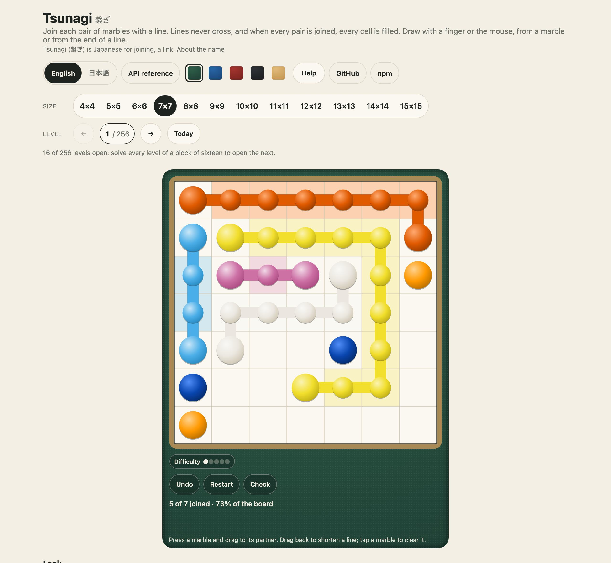
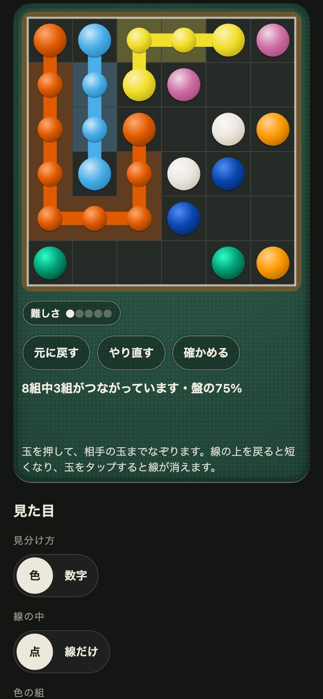

<h1 align="center">Tsunagi <sub>つなぎ</sub></h1>

<p align="center"><strong>A line-joining logic puzzle for JavaScript and TypeScript.</strong><br>
Join each pair of marbles with a line, every line its own, until the board is full. Layouts and answers as short codes, the rules a line keeps, a solver that counts answers, a seeded generator, walls, bridges, waypoints and hexagon boards, a difficulty measure, and 1,792 levels from 4×4 to 12×12, each proved to have exactly one answer. The board drawn as SVG, in colours or numbers, dots or lines, and played by touch and mouse in any page with one call or one tag. No dependencies.</p>

<p align="center">
  <a href="https://github.com/johnmorrisdotca/tsunagi/actions/workflows/ci.yml"></a>
  <a href="https://www.npmjs.com/package/@johnmorrisdotca/tsunagi"></a>
  <a href="./LICENSE"></a>
  
</p>

<p align="center"><a href="https://johnmorrisdotca.github.io/tsunagi/"><strong>Play a level →</strong></a> · <a href="https://johnmorrisdotca.github.io/tsunagi/api.html">API reference</a></p>

<p align="center">
  
  
</p>

Tsunagi is the puzzle sometimes called Number Link, Arukone or Flow. It is
played at [itsutsu.com](https://itsutsu.com/games/tsunagi), which this package
was taken out of, and in [the demo](https://johnmorrisdotca.github.io/tsunagi/),
with nothing to install.

## In 30 seconds

```sh
npm install @johnmorrisdotca/tsunagi
```

```ts
import { allJoined, answerOf, checkTsunagiAnswer, decodeLayout, dragThrough, noLines, pressAt } from "@johnmorrisdotca/tsunagi";
import { TSUNAGI_5 } from "@johnmorrisdotca/tsunagi/levels-5";

const [givens, answer] = TSUNAGI_5[0];         // level 1 at 5×5: its layout and its one answer
const layout = decodeLayout(givens, 5)!;        // the marbles, walls, bridges and waypoints, as numbers

let lines = noLines(layout);                     // nothing drawn yet
({ lines } = pressAt(layout, lines, layout.ends[0][0]));   // a finger down on the first marble…
lines = dragThrough(layout, lines, 0, 5);        // …and drawn down a row to cell 5, as a line may go

allJoined(layout, lines);                        // has every pair been joined?
checkTsunagiAnswer(5, givens, answerOf(layout, lines));   // { ok: true } or { ok: false, reason }
```

And in a page, a level to play, by touch and mouse, with nothing else to set up:

```html
<script type="module" src="https://cdn.jsdelivr.net/npm/@johnmorrisdotca/tsunagi@1/dist/element-define.js"></script>
<tsunagi-board size="6" level="3" marks="numbers" fill="lines" board="wood"></tsunagi-board>
```

## Who it is for

- **Puzzle sites and apps** that want Tsunagi with the rules already right:
  fixed levels everybody plays alike, a check a server can trust in O(cells),
  and the drawing a finger does (press, drag, let go) as pure functions.
- **Anyone making line puzzles of their own**, who wants a solver that counts
  answers, a generator that makes boards with exactly one, and the twists
  (walls, bridges, waypoints, a board that wraps, hexagons) to vary them.
- **Pages that just want the board**: it draws itself as SVG text (colours or
  numbers on the marbles, dots or lines, four colour sets, six boards), and
  plays itself in an element or one function call, with Undo, Restart, Check,
  Cheat, the zoom pad a big board needs, and its words in English and Japanese.

## The puzzle

Each letter in a layout is a marble, and each marble has one partner. A line
joins the two, stepping from cell to cell, never crossing another line, and
when every pair is joined every cell is filled. A level has exactly one answer.

- **Walls** between two cells, and **blocked** cells, that no line may pass.
- **Bridges**, crossed straight across by one line and straight down by
  another.
- **Waypoints**, a cell a pair's own line must pass through.
- **Wrap**, a board whose edges join, so a line leaving one side comes back
  on the other.
- **Hexagons**, a board of six-sided cells, six ways round.
- **Sparse** boards, with fewer marbles and more room, and **explosions** and
  **strokes**, a limit on how a board may be drawn.

## Drawing a board

```ts
import { decodeLayout, linesOfAnswer } from "@johnmorrisdotca/tsunagi";
import { drawTsunagi, TSUNAGI_STYLE } from "@johnmorrisdotca/tsunagi/draw";

const layout = decodeLayout(givens, 7)!;
const svg = drawTsunagi(layout, { lines: linesOfAnswer(layout, answer)!, marks: "numbers", fill: "lines", board: "wood" });
```

`drawTsunagi` returns SVG text: put it in a page, a file or an image, with nothing
to load. It draws what itsutsu.com draws. Marbles on a board; each line a thick
rounded stroke through its cells' middles; every cell a line runs through
washed faintly in its colour and, with `fill: "marbles"`, holding a small marble
too, so a finished board is a board of marbles joined by their lines. Walls are
bars on the edge between two cells and blocked cells are dark squares. A
**bridge** is drawn as a bridge: the line going down passes *under* its deck and
is lost beneath it, and the line going across is drawn over the deck. A
**waypoint** is a ring in its line's colour. A board that **wraps** has a faded
ghost of the far edge all round it and a dashed rim, and a line across the join
leaves by one edge and comes in by the other. A **hexagon** is a honeycomb of
hexagons, in the same square box as every board.

| Option | Values | What it does |
| --- | --- | --- |
| `lines` | `Lines` | the lines drawn so far; none, if left out |
| `marks` | `colours` (default), `numbers` | tell the pairs apart by colour, or by the pair's number on a plain shell marble with every line in a soft tint |
| `fill` | `marbles` (default), `lines` | a small marble (the dots) in every cell a line runs through, or the line alone |
| `colours` | `marble` (default), `bright`, `colour-blind`, `soft`, or your own `[hue, saturation, lightness][]` | each pair's colour; a set of your own is used round and round |
| `board` | `paper` (default), `wood`, `green`, `blue`, `red`, `black`, or a `TsunagiBoardLook` | the paper, the frame, the rules and the ink of walls and bridges; `paper` takes its colours from the page's light or dark |
| `coordinates` | boolean | row numbers and column letters down the sides (not on a board that wraps or a hexagon) |
| `ghosts` | boolean, default true | the ghost of the far edge round a board that wraps |
| `flagged` | pairs | the marbles of these pairs flash: what Check found not joined |
| `blasted` | cells | each bursts: where an explosion took a line out |
| `done` | boolean | a faint wash of green, and `data-solved="true"` |
| `language` | `en` (default), `ja` | what a screen reader hears |
| `label`, `style`, `id` | | a description instead of the size; `style: true` puts `TSUNAGI_STYLE` inside so the drawing stands alone as an image; the prefix of the ids in the drawing, made from the drawing itself if left out so two never share one |

A custom board is a look of colours: `{ paper: "#fbf8f1" | ["#f0cf95", "#d3a662"], frame, grid, ink, coordinate }`.
Every colour is also a custom property on `.tsunagi` (`--tsu-paper`,
`--tsu-paper-deep`, `--tsu-frame`, `--tsu-grid`, `--tsu-ink`, `--tsu-coordinate`,
`--tsu-shu`, `--tsu-good`), so a page sets only what it wants different.
The parts carry classes and data attributes to style or find them: `tsu-marble`
(`data-pair`, `data-cell`), `tsu-bead`, `tsu-line` (`data-pair`, `data-cells`),
`tsu-bridge`, `tsu-over-bridge`, `tsu-wall` (`data-edge`), `tsu-waypoint`,
`tsu-flag`, `tsu-blast`, `tsu-hex-cell`. Nothing in the drawing can be selected,
dragged or double-tapped into a selection, and with reduced motion asked for
nothing moves. `drawTsunagiCode(givens, size, options)` draws a level from its
code, and `drawTsunagiMarble(pair, options)` one marble for a legend. `tsunagiGeometry(layout)`
and `cellAtPoint(geometry, x, y)` say where every cell is in the drawing and which
cell a point is over, so a page of your own can play it.

## Playing it in a page

```ts
import { mountTsunagi } from "@johnmorrisdotca/tsunagi/play";

const board = mountTsunagi(document.getElementById("here")!, {
  size: 7, givens, answer, level: 12,         // a level; `level` shows its difficulty and its place in its block
  marks: "numbers", fill: "lines", colours: "colour-blind", board: "wood",
  cheats: true, explosions: "soft", chips: true,
  onSolve: ({ answer, helped }) => send(answer, helped),   // `answer` is what checkTsunagiAnswer takes
});
board?.undo(); board?.check(); board?.load({ size: 7, givens: other, answer: otherAnswer });
```

It plays the way the site does. Press a marble (or the end of a line) and drag to
its partner; drag back over a line to shorten it, cell by cell; tap a marble to
clear its line; a line dragged into another cuts the other back. Pointer events,
captured on the press so a drag that leaves the board still ends, with
`touch-action: none` so a finger drawing a line never scrolls the page. A big
board (10×10 up) is looked at through a box with a zoom and move pad, the wheel,
and the box's edge, which moves the view while a line is dragged near it. The box
keeps one steady square, and the lines of words under it keep the room they need,
so nothing moves as lines are drawn or messages come and go.

Under the board, unless `controls: false`: **Undo**, **Restart**, **Check** (the
marbles of pairs not joined flash, and it says how many) and, if `cheats` is on and
the level has an `answer`, **Cheat**, which draws one unfinished line and marks the
solve *helped*; a line of progress; and the lines a level's twists ask for: strokes
left of a limit, the count to the next explosion, what the last explosion did. `chips`
adds a row with the level's difficulty (1 to 5) and a chip for each challenge on it,
pressed to say what it means. Everything a button does is also a method on the
handle (`undo`, `restart`, `check`, `cheat`, `fit`, `load`, `set`, `destroy`).

| Option | What it does |
| --- | --- |
| `size`, `givens`, `answer`, `level` | the level; `answer` is needed for Cheat and makes a solve the stored answer |
| `lines` | lines to start from: a kept game (`decodeLines`) or a solved board to show |
| `marks`, `fill`, `colours`, `board`, `coordinates` | the look, as for `drawTsunagi`; change them with `set` and they take effect at once |
| `explosions` | `on` (default), `soft` (a boom for a blast, half as often) or `off`; a solve with either help is `helped` |
| `cheats` | offer Cheat |
| `controls`, `chips`, `zoom` | the buttons and words (default on), the chips (default off), and the pad: `auto` from 10×10, `on`, `off` |
| `language` | `en` or `ja`; left out, the host's `lang` or the page's, and it follows the page's |
| `onChange`, `onStroke`, `onExplosion`, `onSolve` | callbacks, and the same four as DOM events on the host: `tsunagi-change`, `tsunagi-stroke`, `tsunagi-explosion`, `tsunagi-solve`. Each `detail` has `lines`, `code` (to keep the game), `progress`, `answer` and `helped` |

Ctrl or Cmd with Z undoes. The rules are `game.ts`'s, which are pure and need no
page, so a server can replay a game's strokes.

### The element

```html
<script type="module" src="https://cdn.jsdelivr.net/npm/@johnmorrisdotca/tsunagi@1/dist/element-define.js"></script>
<tsunagi-board size="6" level="3"></tsunagi-board>
<tsunagi-board size="5" givens=".A..." answer="..." marks="numbers" fill="lines" colour-set="soft" board="green" coordinates cheats chips></tsunagi-board>
```

Or `import "@johnmorrisdotca/tsunagi/element/define"` in a bundle. Attributes, each read again
when it changes: `size` with `level` (the package's own levels, fetched when asked) or with `givens` and
`answer`; `marks` (`colours` or `numbers`); `fill` (`marbles` or `lines`); `colour-set` (`marble`,
`bright`, `colour-blind`, `soft`); `board` (`paper`, `wood`, `green`, `blue`, `red`, `black`);
`coordinates`; `explosions` (`on`, `soft`, `off`); `cheats`; `controls="off"`; `chips`; `zoom`;
`progress` (a `code` from an event, to carry on a kept game); `lang`. A look changes at once
without starting a new game; the level, `explosions` and `cheats` start it again. It fires the four
events above and has the methods `undo()`, `restart()`, `check()`, `cheat()` and `fit()`.
Importing either entry on a server is safe.

## Levels

```ts
import { loadTsunagiLevels, openTsunagiLevels, TSUNAGI_LEVEL_COUNTS } from "@johnmorrisdotca/tsunagi/levels";

const sevens = await loadTsunagiLevels(7);       // 256 levels, easiest first; only 7×7 is fetched
openTsunagiLevels(7, new Set([1, 2, 3]));         // 16: the first block of sixteen is open from the start
```

| Size | Levels | Size | Levels | Size | Levels |
| --- | --- | --- | --- | --- | --- |
| 4×4 | 192 | 7×7 | 256 | 10×10 | 128 |
| 5×5 | 256 | 8×8 | 256 | 11×11 | 64 |
| 6×6 | 256 | 9×9 | 256 | 12×12 | 128 |

Every level was made once by `scripts/tsunagi-levels.ts` and is proved again
on every build: solved from scratch, it must have exactly one answer, the one
stored, filling every cell, with no two levels the same board turned or
mirrored. Levels come in blocks of sixteen, each block no easier on average
than the one before, the fifteenth and sixteenth its twist; a block opens
once every level of the one before is solved. `TSUNAGI_MARKS`
(`@johnmorrisdotca/tsunagi/marks`) rates every level 1 to 5 from its measured
difficulty.

| Import | What it holds |
| --- | --- |
| `@johnmorrisdotca/tsunagi` | the rules, the solver, the generator, the levels' counts, and `game.ts`'s pure play functions: everything but the boards, the drawing and the page |
| `@johnmorrisdotca/tsunagi/draw` | `drawTsunagi` and the rest of the drawing as SVG text, the colour sets, the boards, the style, and where everything sits in the drawing; no page needed |
| `@johnmorrisdotca/tsunagi/play` | `mountTsunagi`: a level played in any element by touch and mouse, with its buttons, words, zoom pad and events |
| `@johnmorrisdotca/tsunagi/element` | the `TsunagiBoard` class behind `<tsunagi-board>`, to extend or to define under another name |
| `@johnmorrisdotca/tsunagi/element/define` | defines `<tsunagi-board>` on the page, for its effect |
| `@johnmorrisdotca/tsunagi/levels` | `loadTsunagiLevels(size)`, `loadEveryTsunagiLevel()`, `tsunagiLevelsOf(size)`, `tsunagiLevelOf(size, layout)`, each size fetched only when loaded |
| `@johnmorrisdotca/tsunagi/levels-4` … `/levels-12` | one size's levels, `TSUNAGI_4` … `TSUNAGI_12`, as `[layout, answer]` pairs |
| `@johnmorrisdotca/tsunagi/marks` | `TSUNAGI_MARKS` (each level's 1 to 5) and `TSUNAGI_ROLES` (each twist level's part in its block) |
| `@johnmorrisdotca/tsunagi/renumbered` | where each old level went when the levels were renumbered on 2026-09-26, for anyone who stored solves by number |

## API

The [API reference](https://johnmorrisdotca.github.io/tsunagi/api.html) lists every export of every entry point with its signature and its doc comment. It is made from the source by `pnpm site`, so it cannot fall behind the code.

| Export | What it does |
| --- | --- |
| `decodeLayout(code, size)`, `encodeLayout(cells, walls, more)` | a layout's code and the `LinkLayout` it stands for: marbles (`ends`), cells, walls, waypoints, wrap, hexagon |
| `encodeAnswer(owners)`, `answerOf(layout, lines)`, `linesOfAnswer(layout, answer)` | an answer as a code: a letter for each cell's line, `#` blocked, `+` a bridge |
| `checkTsunagiAnswer(size, layout, answer)` | whether an answer joins every pair as the rules allow, in O(cells); `{ ok: true }` or the first reason it does not |
| `noLines`, `pressAt`, `dragTo`, `dragThrough`, `letGo` | drawing, as a finger does it: each takes the lines drawn so far and returns new ones |
| `joined`, `allJoined`, `unjoinedPairs`, `filled`, `ownersOf` | what the lines drawn so far amount to |
| `encodeLines`, `decodeLines` | lines half drawn, as a code, to keep a game and come back to it |
| `countSolutions(layout, limit, budget)` | counts answers up to `limit`, within a `budget` of search steps, and returns one |
| `candidate`, `repairedCandidate`, `sparseCandidate`, `layoutOf` | a new board from a seeded `Random`: a random filling of lines, cut back to its ends |
| `bridgeCandidate`, `wallCandidate`, `waypointCandidate`, `wrapCandidate`, `hexCandidate`, `bridgeAndWallCandidate` | a board with a twist |
| `measureLevel`, `difficultyScores`, `orderByDifficulty` | how hard a board is: corners, guessing, cells not forced, its longest line |
| `challengesOf`, `isTwist`, `twistRole`, `tsunagiMarks` | what a layout asks of a player, and a level's mark |
| `transformed`, `relettered`, `symmetryKey` | a board turned, mirrored and relettered, and one key for all eight |
| `cheatLine(layout, lines, answer)` | one line of the answer drawn in, for a player who asks for help |
| `newTsunagiGame`, `pressGame`, `dragGame`, `liftGame`, `undoGame`, `restartGame`, `checkGame`, `cheatGame` | a game in play as pure functions: lines, strokes, Undo, explosions, a stroke limit, Check and Cheat; each returns a new game |
| `tsunagiProgress`, `helpOf`, `helpOpensNext`, `strongestTsunagiHelp` | what a game stands at, and which help (Cheat, softened or no explosions) a solve used and what that costs |
| `seededRandom(seed)` | the mulberry32 stream every generator draws from |
| `openTsunagiLevels`, `nextTsunagiLevel`, `firstUnsolvedTsunagiLevel`, `tsunagiBand` | which levels a player may open, which comes next, and which third of a size a level is in |

Every function is pure: it returns new values and never changes what it was
given.

## Making levels

```sh
node scripts/tsunagi-levels.ts 7              # 7×7 again: its twists placed, its marks measured, every board kept at its number
node scripts/tsunagi-levels.ts --grow 10      # 10×10 grown to whole blocks of sixteen and reordered, easiest first
```

The script finds boards with a seeded generator, keeps those the solver proves
have one answer, drops any that is another turned or mirrored, measures and
orders them, and writes the size's file, its marks and its twists. Seeded, so
the same run writes the same files. A board already published keeps its
number unless a size is grown, and then `/renumbered` says where each old
level went.

## Architecture

The rules, the solver, the generator and the game in play are plain functions over short codes,
with no DOM. The drawing is SVG text in an entry of its own, so a server that only checks an
answer never loads it, and the page's part (the mount and the element) is another. Each size's
levels is an entry of its own, so a page loads only the size it shows.

```text
src/
├── index.ts          the main entry: everything but the levels, the drawing and the page
├── code.ts           layouts and answers as short codes, and the board each stands for
├── steps.ts          where a line may go next on a board: walls, bridges, wrap, hexagons
├── lines.ts          the lines a player has drawn, and what a press and a drag do to them
├── check.ts          whether an answer joins every pair as the rules allow
├── solve.ts          the solver, which counts a board's answers up to a limit
├── generate.ts       new boards from a seed: lines laid at random, cut back to their ends
├── twists.ts         boards with a twist: walls, bridges, waypoints, wrap, hexagons
├── sparse.ts         sparse boards: few marbles and long lines
├── explosions.ts     explosions that break a line, and a limit on strokes
├── difficulty.ts     how hard a level is, measured from its board and its answer
├── ladder.ts         what a level asks of a player, read from its board
├── ladder.types.ts   the challenges a board can have
├── cheat.ts          one line of the answer drawn in, for a player who asks for help
├── game.ts           a game in play as pure functions: strokes, Undo, explosions, Check, Cheat, help
├── levels.ts         the "/levels" entry: each size's levels, loaded when asked
├── levelCounts.ts    how many levels each size has
├── levelBlocks.ts    levels in blocks of sixteen, and which a player may open
├── renumber.ts       a record kept by level number, moved to the numbers levels have now
├── levels.suite.ts   the proof each size's levels test runs: one answer, the one stored
├── random.ts         the seeded random numbers every board is made from
├── draw-entry.ts     the "/draw" entry: the drawing, its colours and boards, and where everything sits
├── draw.ts           a board as SVG text: marbles, lines, walls, bridges under and over, wrap, hexagons
├── geometry.ts       where every cell is in the drawing, and which cell a point is over
├── colours.ts        the colour sets, and how a colour is shaded for a marble, a line and a wash
├── boards.ts         the boards a drawing sits on: paper, wood and four felts, or a look of your own
├── style.ts          the drawing's style: its colours as custom properties, a flash and a burst
├── strings.ts        the words, in English and Japanese, for a screen reader and for the board's buttons
├── play-entry.ts     the "/play" entry: a level played in any element
├── mount.ts          mountTsunagi: draws a level into an element and plays it by touch and mouse
├── viewport.ts       the arithmetic of zooming and moving a big board through its box
├── playStyle.ts      the style of a playable board: its box, buttons, words and zoom pad
├── element.ts        the "/element" entry: the <tsunagi-board> class
├── element-define.ts the "/element/define" entry: defines the tag on the page
├── version.ts        the package's version
└── levels/
    ├── size4.data.ts       the 4×4 levels, each a layout and its one answer
    ├── size5.data.ts       5×5
    ├── size6.data.ts       6×6
    ├── size7.data.ts       7×7
    ├── size8.data.ts       8×8
    ├── size9.data.ts       9×9
    ├── size10.data.ts      10×10
    ├── size11.data.ts      11×11
    ├── size12.data.ts      12×12
    ├── marks.data.ts       every level's difficulty, 1 to 5, and each twist's part in its block
    └── renumbered.data.ts  where each old level went when the levels were renumbered
```

Tests sit beside the code they test (`*.test.ts`, one `levels.<size>.test.ts`
a size). `scripts/` makes the levels and the twists, builds the demo and its API reference page and checks
the package as npm packs it; `demo/` is the playable page, and `e2e/` its browser tests.

## The name

*Tsunagi* (繋ぎ) is Japanese for "joining", "a link": what holds two things
together. It comes from the verb *tsunagu* (繋ぐ), to tie, to connect, to hold
hands, and is said in three beats, *tsu-na-gi*. In the puzzle every pair of
marbles is joined by its own line, and the lines together fill the board.

## Development

```sh
pnpm install
pnpm check          # lint, types and every test, every level proved again
pnpm test:package   # pack, install and import it as somebody who installed it would
pnpm test:demo      # build the demo and play it in a real browser, at a phone's width and a desk's
pnpm site           # build the demo into site/, as the Pages workflow publishes it
```

## Licence

MIT, © John Morris. The levels are part of the package and under the same licence.
